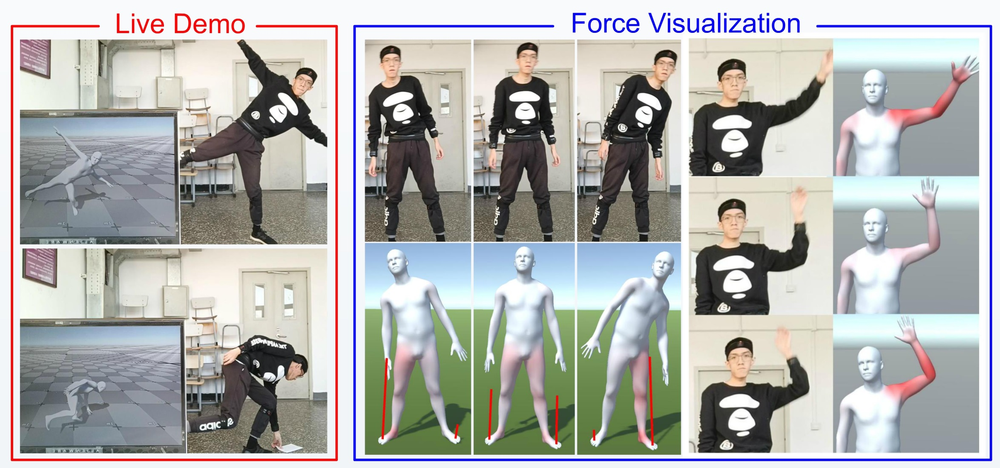

# PIP

Code for our CVPR 2022 [paper](https://arxiv.org/abs/2203.08528) "Physical Inertial Poser (PIP): Physics-aware Real-time Human Motion Tracking from Sparse Inertial Sensors". This repository contains the system implementation and evaluation.  See [Project Page](https://xinyu-yi.github.io/PIP/).



## Usage

### Install dependencies

We use `python 3.7.6`. You should install the newest `pytorch chumpy vctoolkit open3d pybullet qpsolvers cvxopt`.

You also need to compile and install [rbdl](https://github.com/rbdl/rbdl) with python bindings. Also install the urdf reader addon. This library is easy to compile on Linux. For Windows, you need to rewrite some codes and the CMakeLists. We have only tested our system on Windows.

*If the newest `vctoolkit` reports errors, please use `vctoolkit==0.1.5.39`.*

*Installing `pytorch` with CUDA is recommended but not mandatory. During evaluation, the motion prediction can run at ~120fps on CPU, but computing the errors may be very slow without CUDA.*

*If you have configured [TransPose](https://github.com/Xinyu-Yi/TransPose/), just use its environment and install the missing packages including the `rbdl`.*

### Prepare SMPL body model

1. Download SMPL model from [here](https://smpl.is.tue.mpg.de/). You should click `SMPL for Python` and download the `version 1.0.0 for Python 2.7 (10 shape PCs)`. Then unzip it.
2. In `config.py`, set `paths.smpl_file` to the model path.

*If you have configured [TransPose](https://github.com/Xinyu-Yi/TransPose/), just copy its settings here.*

### Prepare physics body model

1. Download the physics body model from [here](https://xinyu-yi.github.io/PIP/files/urdfmodels.zip) and unzip it.
2. In `config.py`, set `paths.physics_model_file` to the body model path.
3. In `config.py`, set `paths.plane_file`  to `plane.urdf`. Please put `plane.obj` next to it.

*The physics model and the ground plane are modified from [physcap](https://github.com/soshishimada/PhysCap_demo_release).*

### Prepare pre-trained network weights

1. Download weights from [here](https://xinyu-yi.github.io/PIP/files/weights.pt).
2. In `config.py`, set `paths.weights_file` to the weights path.

### Prepare test datasets

1. Download DIP-IMU dataset from [here](https://dip.is.tue.mpg.de/). We use the raw (unnormalized) data.
2. Download TotalCapture dataset from [here](https://cvssp.org/data/totalcapture/). You need to download `the real world position and orientation` under `Vicon Groundtruth` in the website and unzip them. The ground-truth SMPL poses used in our evaluation are provided by the DIP authors. So you may also need to contact the DIP authors for them.
3. In `config.py`, set `paths.raw_dipimu_dir` to the DIP-IMU dataset path; set `paths.raw_totalcapture_dip_dir` to the TotalCapture SMPL poses (from DIP authors) path; and set `paths.raw_totalcapture_official_dir` to the TotalCapture official `gt` path. Please refer to the comments in the codes for more details.

*If you have configured [TransPose](https://github.com/Xinyu-Yi/TransPose/), just copy its settings here. **Remember**: you need to rerun the `preprocess.py` as the preprocessing of TotalCapture dataset has been changed to remove the acceleration bias.*

### Run the evaluation

You should preprocess the datasets before evaluation:

```
python preprocess.py
python evaluate.py
```

The pose/translation evaluation results for DIP-IMU and TotalCapture test datasets will be printed/drawn.

### About the codes

The authors are too busy to clean up/rewrite the codes. Here are some useful tips:

- In `dynamics.py`, there are many disabled options for the physics optimization. You can try different combinations of the energy terms by enabling the corresponding terms. 

- In Line ~44 in `net.py`:

  ```python
  self.dynamics_optimizer = PhysicsOptimizer(debug=False)
  ```

  set `debug=True` to visualize the estimated motions using pybullet. You may need to clean the cached results and rerun the `evaluate.py`. (e.g., set `flush_cache=True` in `evaluate()` and rerun.)

- In Line ~244 in `dynamics.py`:

  ```python
  if False:   # visualize GRF (no smoothing)
      p.removeAllUserDebugItems()
      for point, force in zip(collision_points, GRF.reshape(-1, 3)):
          p.addUserDebugLine(point, point + force * 1e-2, [1, 0, 0])
  ```

  Enabling this to visualize the ground reaction force. (You also need to set `debug=True` as stated above.) Note that rendering the force lines can be very slow in pybullet. 

- The hyperparameters for the physics optimization are all in `physics_parameters.json`.  If you set `debug=True`, you can adjust these parameters interactively in the pybullet window.

## Live Demo

### Prerequisites and configuration

Install the additional prerequisites:

```
pip install pywin32 keyboard bleak
```

In `config.py`, set `temp_dir` and `live_record_dir` for output files. Set `unity_file` to the built unity executable file (Leave it empty if you want to directly run the scene in Unity3D).

We provide a minimal example unity scene for live demo visualization. Download the unity package from [here](https://xinyu-yi.github.io/TransPose/files/visualizer.unitypackage), load the package in Unity3D (>=2019.4.16), and open the `Example` scene.

### Run Live Demo with Xsens Dots

1. Modify the sensor bluetooth address in `articulate/utils/executables/xsens_dot_server.py`. Then, run the Xsens server `xsens_dot_server.py`. If you do not need the server GUI, run `xsens_dot_server_no_gui.py` instead. The no-GUI version is much more stable and faster than the GUI version and is highly recommended. Note that the live demo needs 6 IMUs.
2. If you use the GUI server, click the "connect" button. Then, click "start streaming" and "clear". Then, align the sensors and click "reset heading". If you use the no-GUI server, press shift+L to unlock. Then, press C to connect, S to start streaming, and then align the sensor and press A. Press D to check the alignment. Finally, press L to lock the hotkey.

3. Run `live_demo_xsens.py`. If you did not set the executable file path, run the live demo scene in Unity3D directly by clicking the play button. Then, switch to the python and perform the calibration as instructed in the command line. Then, the capture will start.

*[Author]: In our experiment, Xsens Dot needs frequent heading reset during the live demo (~once every 5 minute) as it has large orientation drifts. We think Notiom sensor is more stable in our case, where we test ~30 minutes and it can perform well with little orientation drift (as shown in the video).*

***[Bug 2023-04-26]: After the heading reset, Xsens dots generate inconsistent acceleration measurements (it seems that the global frame of different sensors is changed differently). This will lead to poor performance of the live demo.***

### Run Live Demo with Noitom IMUs (recommended)

TBD

## Citation

If you find the project helpful, please consider citing us:

```
@InProceedings{PIPCVPR2022,
  author = {Yi, Xinyu and Zhou, Yuxiao and Habermann, Marc and Shimada, Soshi and Golyanik, Vladislav and Theobalt, Christian and Xu, Feng},
  title = {Physical Inertial Poser (PIP): Physics-aware Real-time Human Motion Tracking from Sparse Inertial Sensors},
  booktitle = {IEEE/CVF Conference on Computer Vision and Pattern Recognition (CVPR)},
  month = {June},
  year = {2022}
}
```

